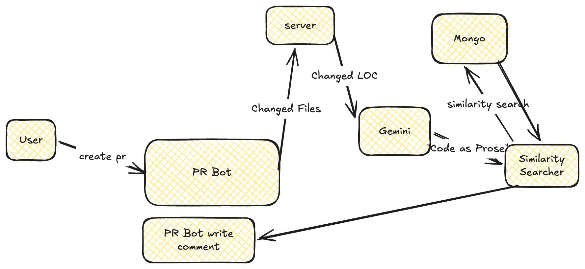

# DocDrift

DocDrift finds the documentation that a code change makes incorrect. It reads
the diff of a pull request (PR). Then it writes a PR comment with links to the
documentation sections that need an update.

Live service: <https://mongodb-hackathon-dublin26-git-wzji4n5axq-ew.a.run.app>



## The problem

Code changes fast. Documentation does not change at the same speed. A
developer changes an API name or a parameter, but the examples in the
documentation keep the old form. Users copy the old examples and get errors.

A person must read all of the documentation to find these sections. DocDrift
does this check on each PR.

## How DocDrift operates

1. A GitHub Actions workflow sends the PR diff to the DocDrift service.
2. Gemini writes a prose description of the code change.
3. MongoDB Atlas Vector Search compares the description with the
   documentation chunks.
4. The service keeps only the chunks with a similarity score of 0.7 or more.
5. Gemini compares the code with each chunk. It finds the text that is
   incorrect, missing, or out of date.
6. The workflow writes the review comment on the PR.

Read [GitHub Actions workflow](docs/github-action.md) for the full procedure.

The demo database contains the LangChain Python documentation.

## Example comment

A PR that uses `ChatOpenAI(model="gpt-4o", temperature=0)` gets a comment
like this:

> - [CrateDB integrations](https://docs.langchain.com/oss/python/integrations/providers/cratedb#invoke-llm-conversation)
>   - Outdated: The `ChatOpenAI` constructor uses `model_name`.
>     - Update to: Use `model` instead of `model_name`.

## Use DocDrift on pull requests

Add this workflow to `.github/workflows/docsdb-bot.yaml`. The workflow sends
each pull request (PR) diff to DocDrift and writes the review comment on the
PR. Add a GitHub personal access token as the `GH_PERSONAL_TOKEN` secret
before you push the file.

Example: the
[langchain-demo workflow](https://github.com/blagoySimandov/langchain-demo/blob/master/.github/workflows/docsdb-bot.yaml).

```yaml
name: Get full PR diff

on:
  pull_request:
    types: [opened, reopened, synchronize]

permissions:
  contents: read
  pull-requests: read

jobs:
  get-pr-diff:
    runs-on: ubuntu-latest

    steps:
      - id: diff
        uses: suzuki-shunsuke/pr-unified-diff-action@c932c1df5f577028d8ca05d2d3c0c059072d8821 # v0.0.1

      - name: Send PR diff to describe service
        env:
          DIFF_PATH: ${{ steps.diff.outputs.diff_path }}
        run: |
          jq -Rs '{code: .}' "$DIFF_PATH" \
            | curl --fail-with-body -sS -X POST \
                https://mongodb-hackathon-dublin26-git-320095644118.europe-west1.run.app/api/describe \
                -H 'content-type: application/json' \
                --data-binary @- \
            | jq -r '.comment' > "$RUNNER_TEMP/comment.md"

      - name: Comment docs review on PR
        uses: peter-evans/create-or-update-comment@e8674b075228eee787fea43ef493e45ece1004c9 # v5.0.0
        with:
          token: ${{ secrets.GH_PERSONAL_TOKEN }}
          issue-number: ${{ github.event.pull_request.number }}
          body-path: ${{ runner.temp }}/comment.md
```

## Quick start

1. Copy `server/.env.example` to `server/.env` and set the values.
2. Start the server:

   ```sh
   cd server && deno task dev
   ```

## Documentation

- [Architecture](docs/architecture.md)
- [API reference](docs/api.md)
- [Setup](docs/setup.md)
- [GitHub Actions workflow](docs/github-action.md)
